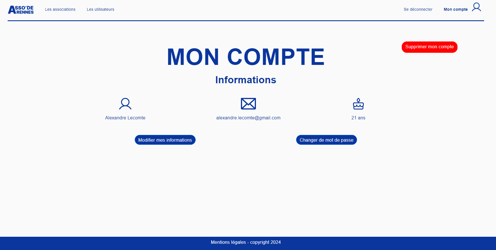
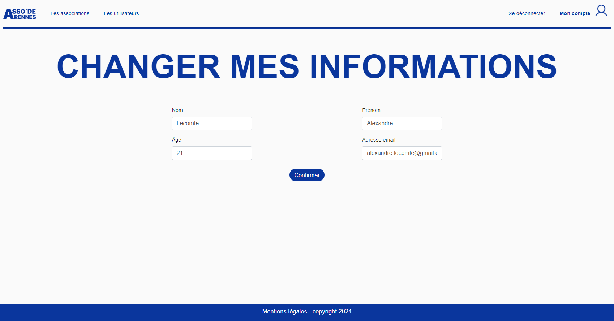
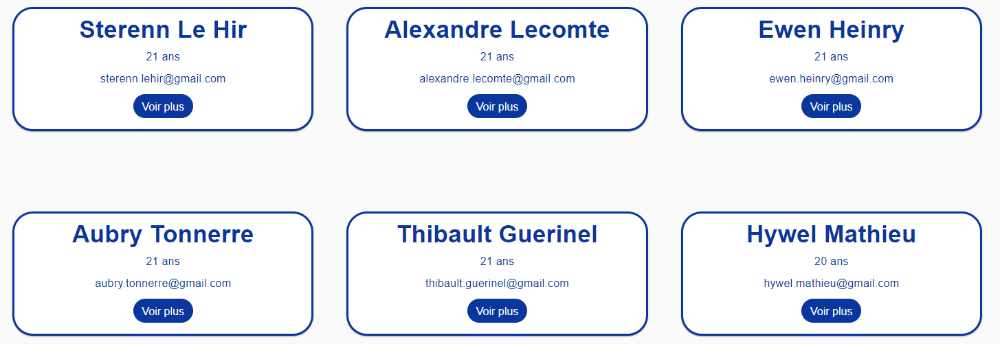

# Asso' de Rennes

Ce projet est généré avec [Angular CLI](https://github.com/angular/angular-cli) version 17.0.7. L'objectif est de fournir un site sur lequel sont recensés les associations de Rennes avec leurs membres, ainsi que tous les utilisateurs du site. 

## Execution

A la racine du projet, lancez `ng serve --open` pour lancer le serveur Angular. Votre navigateur s'ouvrira automatiquement avec l'url indiquée mais si ce n'est pas le cas, naviguez à l'adresse `http://localhost:4200/`. En parallèle, lancez le serveur du back-end [Voir instructions ici](https://github.com/Sterenn35/fr-administration/blob/master/README.md).

## Prototype

Pour concevoir notre site, nous avons dans un premier temps réalisé une maquette sur Figma, disponible [ici]([https://www.figma.com/proto/SjSrg8LIlCfCPDhcexwbzI/Maquette-WM?type=design&node-id=53-222&t=UNXyD6K2QHa3EE9E-0&scaling=min-zoom&page-id=0%3A1&starting-point-node-id=7%3A288](https://www.figma.com/proto/SjSrg8LIlCfCPDhcexwbzI/Maquette-WM?type=design&node-id=7-288&t=njYZBv6gG1S54qhm-1&scaling=min-zoom&page-id=0%3A1&starting-point-node-id=7%3A288&mode=design)).

Nous avons choisi une police moderne Google Font, facile d'implémentation grâce à l'API Google. Nous avons élaboré un design sobre, avec le bleu comme couleur tonique. Il fait ressortir facilement les éléments et est une couleur calme et rassurante. C'est aussi généralement la couleur utilisée par les services publics. 

## Structure

Les diagrammes ci-dessous représente respectivement les liens entre les pages et les routes possibles de l'application.

## Fonctionnalités

Au niveau des fonctionnalités, voici celles que nous avons implémentées : 

- [x] Se connecter via son email
- [x] Se déconnecter
- [x] S'inscrire
- [x] Lister les utilisateurs
- [x] Modifier les informations d'un utilisateur
- [x] Supprimer un utilisateur
- [x] Rechercher un utilisateur par son id
- [x] Lister les associations
- [x] Rechercher une association par son id
- [x] Créer une association
- [x] Supprimer une association
- [x] Modifier une association (nom et description)
- [x] Modifier les membres d'une association (ajout et suppression de membres)
- [x] Modifier les roles des membres d'une association
- [x] Accéder aux minutes d'une association

Nous avons souhaité nous connecter via l'email et non l'id car nous trouvons cela plus facile pour l'utilisateur. Le temps nous a manqué pour pouvoir rechercher un utilisateur et une association par leur nom.

## Conception

Pour les formulaires, nous avons généralement utilisé des ReactiveForm, notamment pour les modifications des informations (utilisateur ou association). Cela permet d'attribuer la valeur initiale des champs à la valeur des attributs des associations ou des utilisateurs, comme le montre l'exemple ci-deesous pour l'utilisateur Alexandre Lecomte. 

Nous avons également utilisé des formGroup et FormControl dans lesquels nous avons ajouté des Validors, pour rendre nos champs obligatoires et/ou pour imposer une valeur minimale (ex : un utilisateur doit être majeur => age >= 18). Avec *ngIf, nous affichons des éléments (des messages d'erreur plus particulièrement) quand les valeurs ne respectent pas ce qui est attendu. 

Pour la page des utilisateurs et des associations, nous avons utilisé Material pour ses cards, faciles d'implémentations et d'utilisation. 

Au niveau des composants, nous avons remarqué que la liste des participants à une minute est similaire à la liste des membres d'une association, nous avons donc créer un composant qui sera un composant enfant de association-detail-item et minute. En Input, il récupère la liste des User à afficher sous la forme d'une table. 

Quand une URL est invalide (route inexistante, accès à un(e) utilisateur/association inconnu(e)), nous renvoyons sur une page 404 Page Not Found que nous avons créé.

